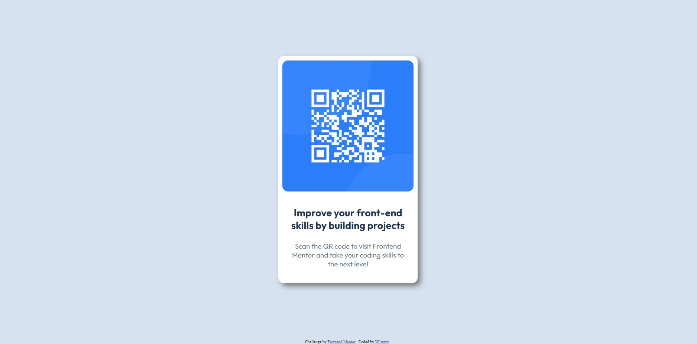

# Frontend Mentor - QR code component solution

This is a solution to the [QR code component challenge on Frontend Mentor](https://www.frontendmentor.io/challenges/qr-code-component-iux_sIO_H). Frontend Mentor challenges help you improve your coding skills by building realistic projects.

## Table of contents

-   [Frontend Mentor - QR code component solution](#frontend-mentor---qr-code-component-solution)
    -   [Table of contents](#table-of-contents)
    -   [Overview](#overview)
        -   [Screenshot](#screenshot)
        -   [Links](#links)
        -   [Built with](#built-with)
        -   [Useful resources](#useful-resources)
    -   [Author](#author)

## Overview

### Screenshot

### Links

-   Solution URL: [Github Pages Link](https://w1ngzy.github.io/qr-component/)

### Built with

-   Semantic HTML5 markup
-   CSS custom properties
-   Flexbox
-   Mobile-first workflow

### Useful resources

-   [W3 Schools](https://www.w3schools.com)
-   [Web.dev](https://web.dev/learn/css/welcome)

## Author

-   Website - [Ruan](https://github.com/W1ngzy)
-   Frontend Mentor - [@W1ngzy](https://www.frontendmentor.io/profile/W1ngzy)
